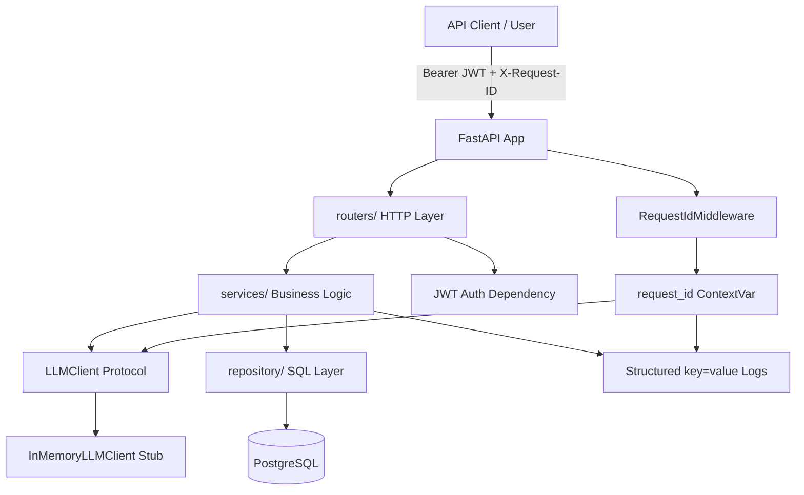
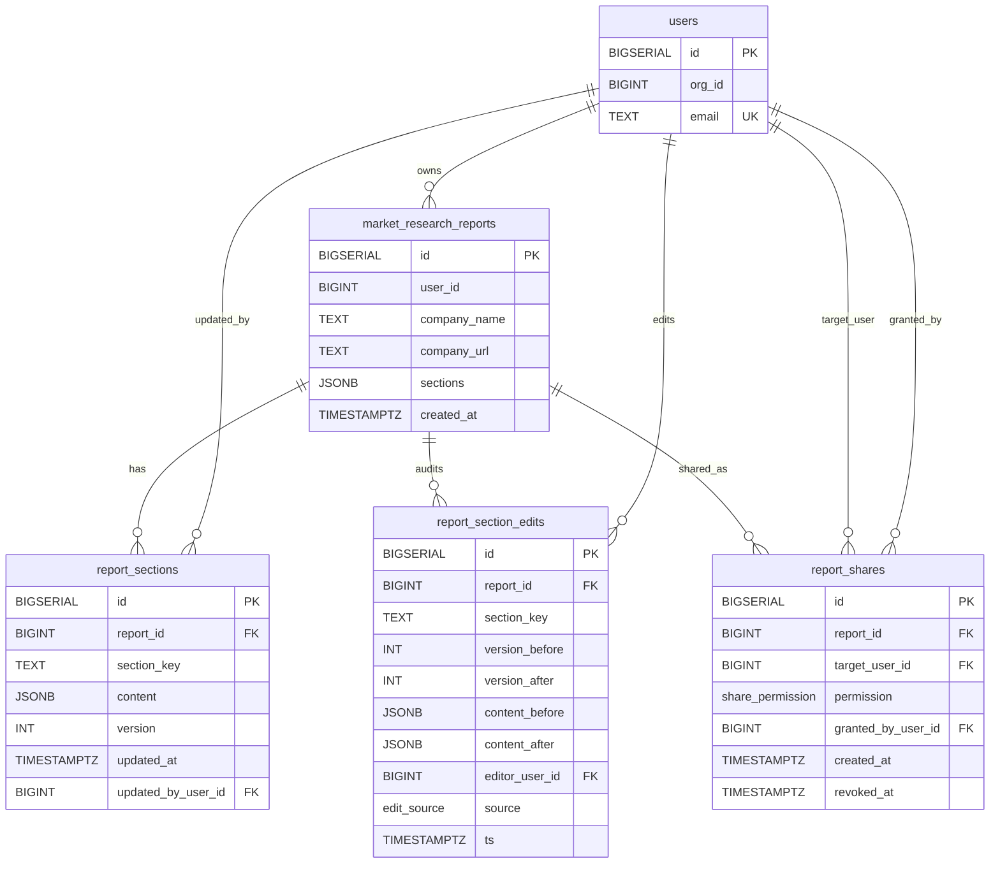
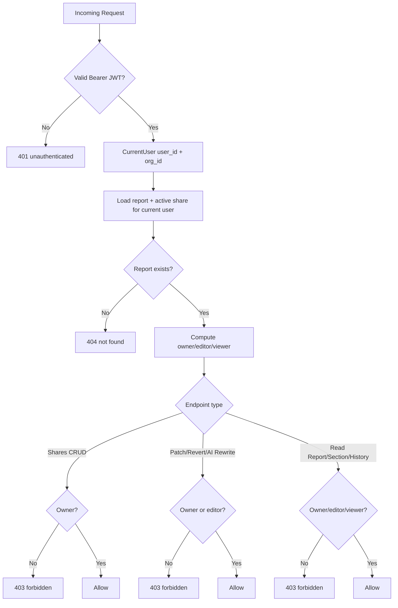
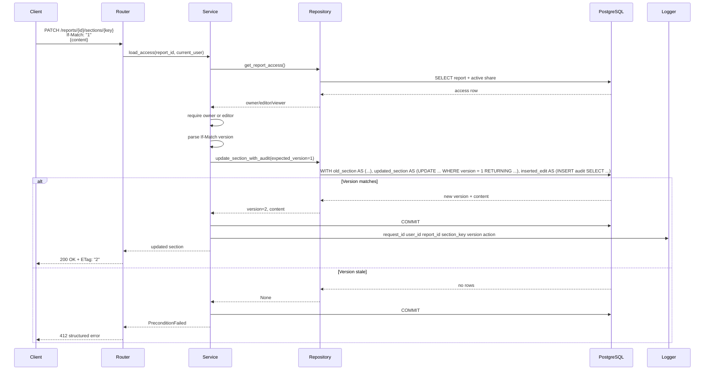
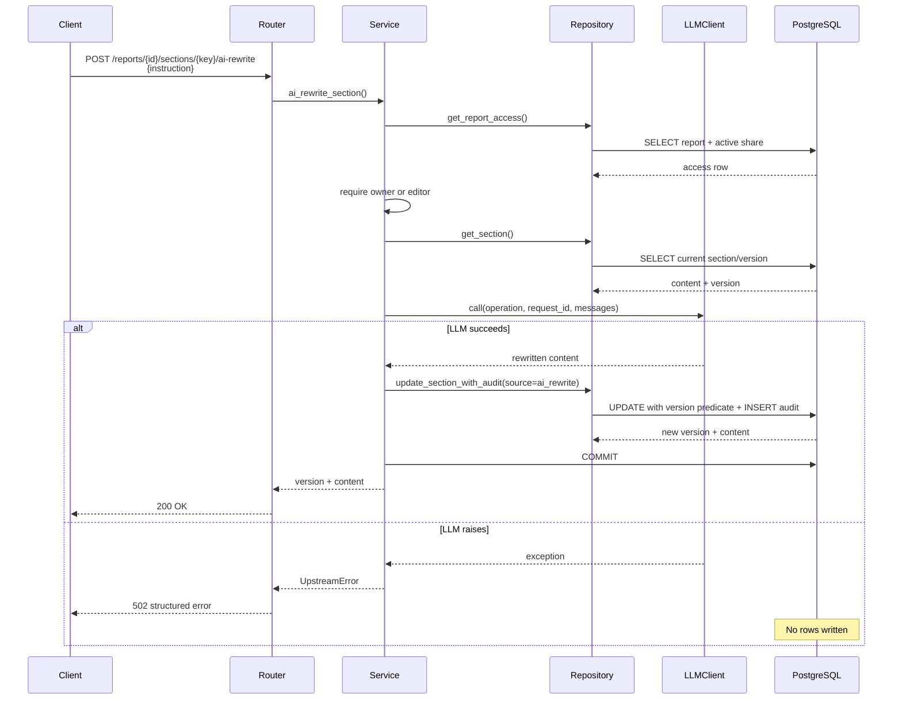
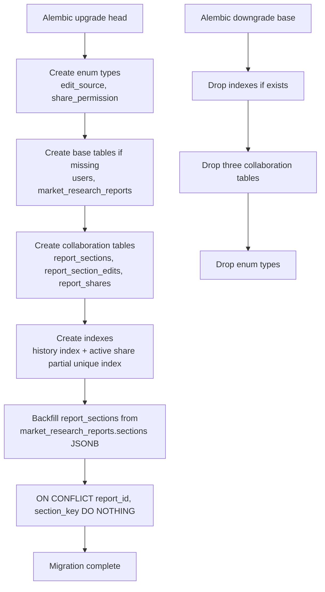
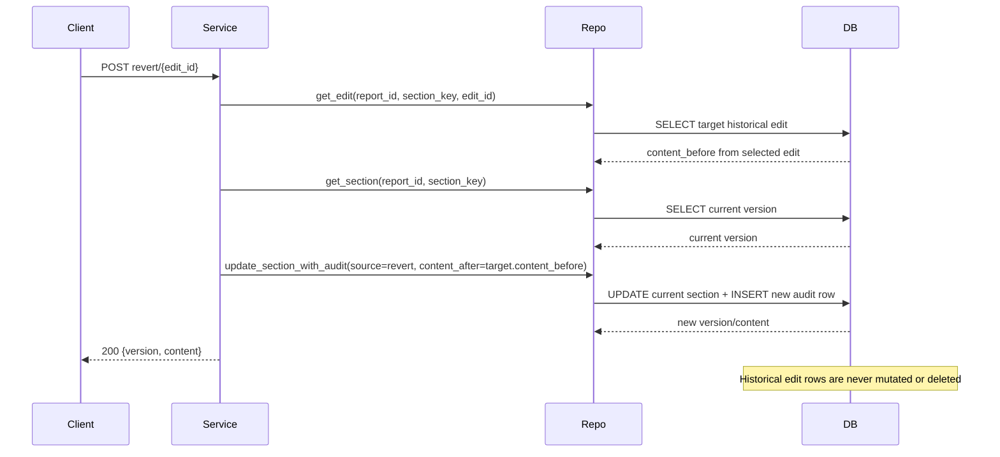

# Architecture Diagrams

This document contains Mermaid diagrams for understanding the project structure, database model, and main runtime flows.

## Architecture

## Database Model

## Request Access Flow

## Section Patch Flow

## AI Rewrite Flow

## Migration / Backfill Flow

## Revert Flow

